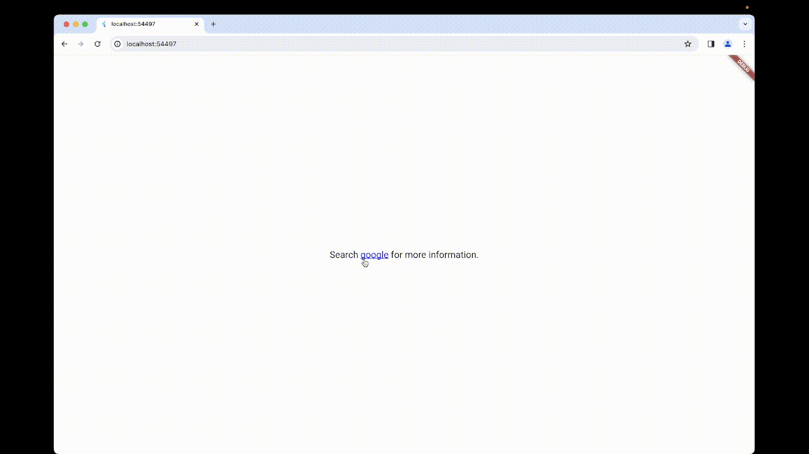

<!--
This README describes the package. If you publish this package to pub.dev,
this README's contents appear on the landing page for your package.

For information about how to write a good package README, see the guide for
[writing package pages](https://dart.dev/guides/libraries/writing-package-pages).

For general information about developing packages, see the Dart guide for
[creating packages](https://dart.dev/guides/libraries/create-library-packages)
and the Flutter guide for
[developing packages and plugins](https://flutter.dev/developing-packages).
-->
# fxf
A Flutter package that converts plain text (txt) into Rich Text using style commands.

## Features
Change a text's boldness in the text itself.
```dart
'''
Hello *(5)World!
'''
```

Change many styles at the same time.
```dart
'''
Hello *(5)~(0xffff0000)World!*(d)~(d)
Hello *(5)~(0xff00ff00)World!*(d)~(d)
Hello *(5)~(0xff0000ff)World!*(d)~(d)
'''
```

Create links (with the help of [url_launcher](https://pub.dev/packages/url_launcher)).
```dart
'''
Search #(https://www.google.com/)google#(d) for more information.
'''
```


## Usage

Minimal example for getting started.

```dart
import 'package:fxf/fxf.dart' as fxf;

class MyWidget extends StatelessWidget {
  ...
  Widget build(BuildContext context) {
    return Center(
      child: fxf.Text("Hello *(5)World!"),
    );
  }
}
```

Example for creating links using [url_launcher](https://pub.dev/packages/url_launcher).
```dart
import 'package:fxf/fxf.dart' as fxf;
import 'package:url_launcher/url_launcher.dart';

class MyWidget extends StatelessWidget {
  ...
  Widget build(BuildContext context) {
    return Center(
      child: fxf.Text(
        "Search #(https://www.google.com/)google#(d) for more information.",
        onLinkTap: (link) {
          launchUrl(Uri.parse(link));
        },
      ),
    );
  }
}
```

## Style Commands
```
* - bold
! - underline
^ - size
~ - color
` - italics
@ - font
# - link
```

### Bold - *
```
*(weight: int)
```
**weight**: an integer clipped between [-3 - 5] and corresponds to [FontWeight](https://api.flutter.dev/flutter/dart-ui/FontWeight-class.html). 0 means normal font weight. 5 means [FontWeight.w900](https://api.flutter.dev/flutter/dart-ui/FontWeight/w900-constant.html). -3 means [FontWeight.w100](https://api.flutter.dev/flutter/dart-ui/FontWeight/w100-constant.html).


### Underline - !
```
!(lineType: int, lineStyle: int, color: int)
```
**lineType**: an integer clipped between [0 - 3] and corresponds to [TextDecoration](https://api.flutter.dev/flutter/dart-ui/TextDecoration-class.html):

0. [TextDecoration.none](https://api.flutter.dev/flutter/dart-ui/TextDecoration/none-constant.html)
1. [TextDecoration.underline](https://api.flutter.dev/flutter/dart-ui/TextDecoration/underline-constant.html)
2. [TextDecoration.overline](https://api.flutter.dev/flutter/dart-ui/TextDecoration/overline-constant.html)
3. [TextDecoration.lineThrough](https://api.flutter.dev/flutter/dart-ui/TextDecoration/lineThrough-constant.html)

**lineStyle**: an integer clipped between [0 - 4] and corresponds to [TextDecorationStyle](https://api.flutter.dev/flutter/dart-ui/TextDecorationStyle.html).

**color**: an integer clipped between [0x00000000 - 0xffffffff] and corresponds to [TextStyle.decorationColor](https://api.flutter.dev/flutter/painting/TextStyle/decorationColor.html).


### Size - ^
```
^(size: double)
```

**size**: a double clipped between [0 - infinity] and corresponds to [TextStyle.fontSize](https://api.flutter.dev/flutter/painting/TextStyle/fontSize.html).


### Color - ~
```
~(color: int)
```
**color**: an integer clipped between [0x00000000 - 0xffffffff] and corresponds to [TextStyle.color](https://api.flutter.dev/flutter/painting/TextStyle/color.html).

### Italics - `
```
`(isOn: int)
```
**isOn**: an integer clipped between [0 - 1] and corresponds to [FontStyle](https://api.flutter.dev/flutter/dart-ui/FontStyle.html).

### Font - @
```
@(font: str)
```
**font**: a string that corresponds to [TextStyle.fontFamily](https://api.flutter.dev/flutter/painting/TextStyle/fontFamily.html).


### Link - \#
```
#(link: str, styleChange: int, color: int, isUnderline: int)
```
**link**: a string that holds the link.

**styleChange**: an integer clipped between [0 - 1]. If 0, the link text will not change it's style when hovered over. Otherwise, change link text style.

**color**: an integer clipped between [0x00000000 - 0xffffffff] and corresponds to [TextStyle.color](https://api.flutter.dev/flutter/painting/TextStyle/color.html). This color will only appear when hovered over or clicked.

**isUnderline**: an integer clipped between [0 - 1]. If 0, the link will not be underlined. Otherwise, underline.


### Default values - "d"

When style commands have as input ```"d"``` as in ```*(d)```, it defers to the default TextStyle for the corresponding style command. For example, if the default font weight is normal, then ```*(d)``` is actually ```*(0)```. If the default font weight is bold, then ```*(d)``` is ```*(3)```.

The same can be said for style commands with more than one parameter like underline. Not every parameter for underline needs to be specified in the style command. Ex: ```!(1)``` underlines the text, but keeps the default **lineStyle** and **color** alone.

For link commands, when ```#(d)``` is used, it's to end a link area ([see example above](#features)).

## Installation
In your ```pubspec.yaml```, add to your dependencies:
```yaml
dependencies:
    ...
    fxf:
        git:
            url: https://github.com/getrod/fxf.git
```

<!-- ## Features

TODO: List what your package can do. Maybe include images, gifs, or videos.

## Getting started

TODO: List prerequisites and provide or point to information on how to
start using the package.

## Usage

TODO: Include short and useful examples for package users. Add longer examples
to `/example` folder.

```dart
const like = 'sample';
```

## Additional information

TODO: Tell users more about the package: where to find more information, how to
contribute to the package, how to file issues, what response they can expect
from the package authors, and more. -->
